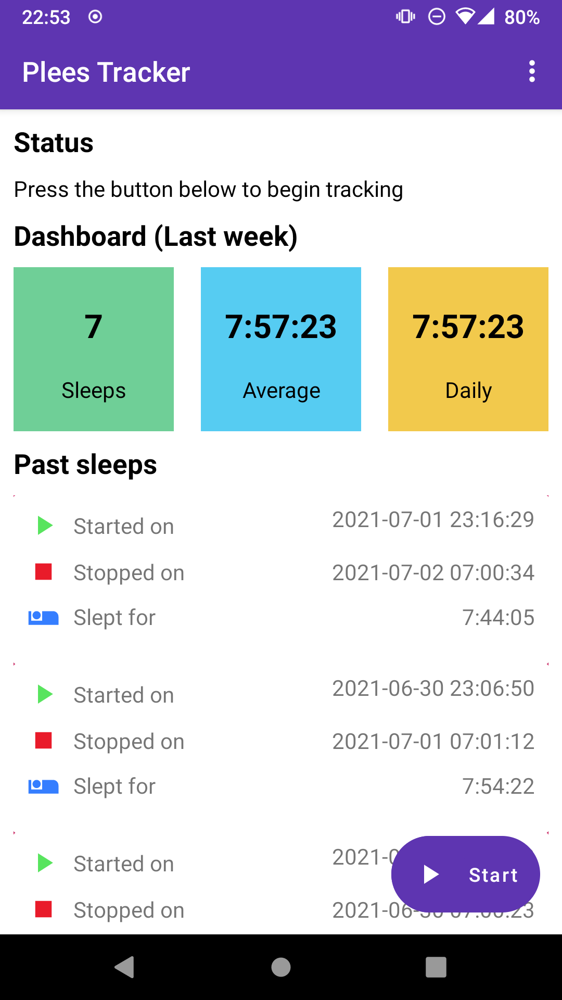

= sleep-tracker  - WIP!!!    

image:https://github.com/ELY3M/sleep-tracker/workflows/tests/badge.svg["Build Status", link="https://github.com/ELY3M/sleep-tracker/actions"]

Plees Tracker is a simple sleep tracker for your Android phone.

= Elys Changes 
1. Added Auto stop tracking on phone movement and it can be enabled or disabled in the settings.    
2. Added delete all sleep data to wipe out all sleep data.   
3. minor changes? I forgot.   

The latest version is v7.3.2, released on 2022-05-06.  See the
https://github.com/vmiklos/plees-tracker/blob/master/NEWS.adoc[release notes] and the
https://github.com/vmiklos/plees-tracker/blob/master/doc/README.adoc[documentation].

== Description

This is meant to be a very simple open source clone of
https://play.google.com/store/apps/details?id=com.primenap[PrimeNap], i.e. just track sleep
start/stop times and count the average / day.

Features:

- It literally does nothing while you sleep, causes no battery drain.

- Stores past sleeps, counts stat from them.

- Exports/imports sleep data to/from CSV.

- Can show past sleeps, can selectively delete individual sleeps.

It looks like this:

== License

Use of this source code is governed by a BSD-style license that can be found in
the LICENSE file.
